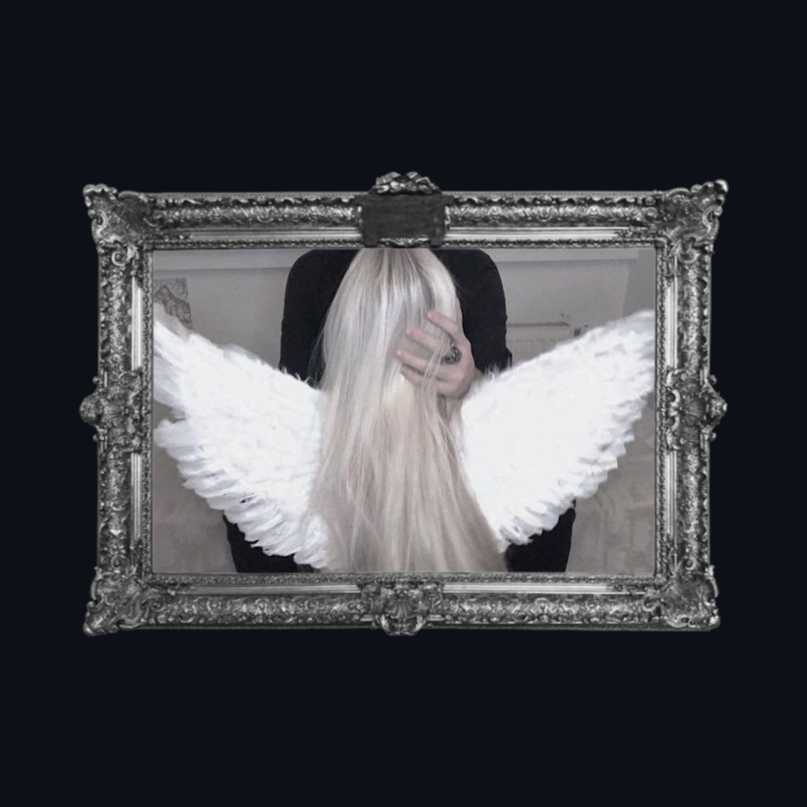

  

  

    .&nbsp;&nbsp;&nbsp;&nbsp;　　𐙚𓏵𓏵𓏵𐙚

    𓂃&nbsp;&nbsp;&nbsp;&nbsp;&nbsp;&nbsp;&nbsp;&nbsp;&nbsp;&nbsp;&nbsp;&nbsp;&nbsp;&nbsp;&nbsp;&nbsp;&nbsp;&nbsp;<em>𝒾𝓈_&nbsp;&nbsp;_ᥲ</em>&nbsp;&nbsp;&nbsp;&nbsp;&nbsp;&nbsp;&nbsp;&nbsp;&nbsp;&nbsp;&nbsp;･ ׄ𓏵𓏵　  

 

  

    
    – 𝚊. &nbsp;𝓂ℯ
  

  
  

  
  

  

    예수님 | .͏  
    

    

      "𝓐 tecnologia é apenas uma ferramenta. No que diz respeito a fazer as crianças trabalharem juntas e se motivarem, o professor é o mais importante.” – Bill Gates  
    

    

    ⠁nαme: isadora 
    ⠁gender +y: she /20y 
    ⠁hobbies: web dev, UX, gαmes 
    ⠁studying: systems αnαlysis and development @ FACULDADE DE TECNOLOGIA SENAC PR 
    ⠁working: API, technicαl support & consulting (Meta Business) and others
    

    

